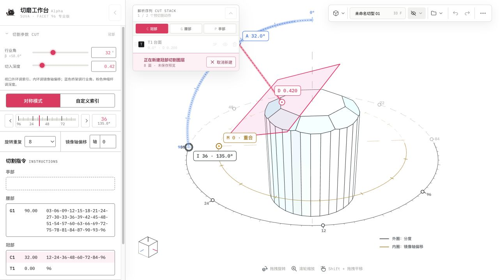
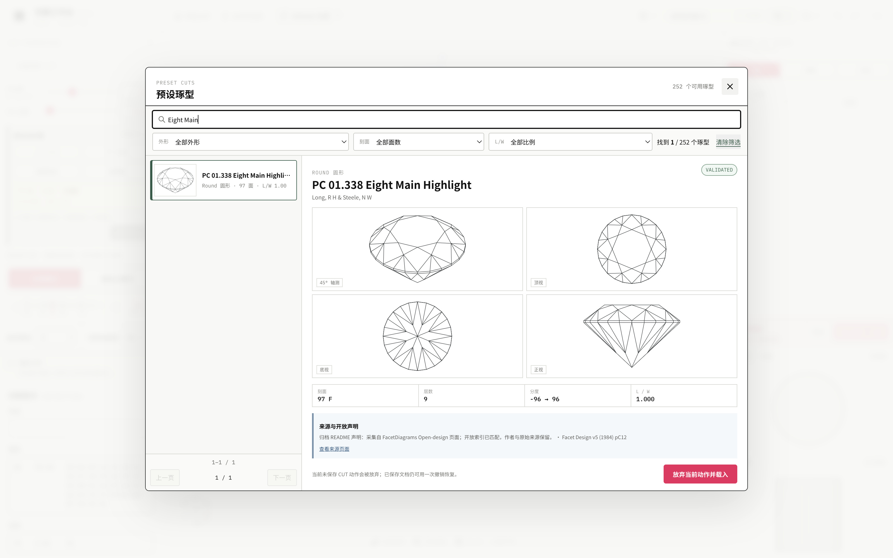
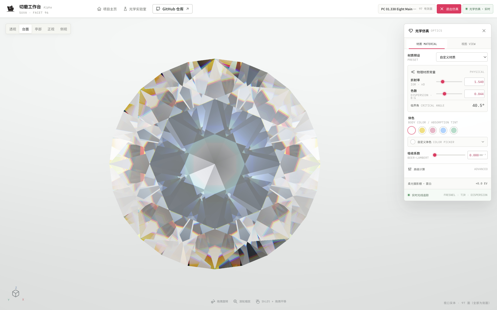

<p align="right">
  <a href="https://yuyou-dev.github.io/OpenGemCutting/"><strong>Live Demo ↗</strong></a> ·
  <a href="https://yuyou-dev.github.io/OpenGemCutting/manual/facet-96-operation-manual.pdf"><strong>操作手册 PDF</strong></a> ·
  <a href="https://github.com/yuyou-dev/OpenGemCutting/discussions"><strong>Discussions</strong></a>
</p>

<div align="center">
  
  <h1>OpenGemCutting · Facet 96</h1>
  <p><strong>面向 96 分度切磨工艺的参数化宝石 3D 工作台</strong></p>
  <p>A browser-based parametric gemstone faceting workbench for the 96-index system.</p>
  <p>
    <a href="https://yuyou-dev.github.io/OpenGemCutting/"><strong>Live Demo</strong></a> ·
    <a href="https://yuyou-dev.github.io/OpenGemCutting/manual/facet-96-operation-manual.pdf"><strong>操作手册</strong></a> ·
    <a href="#快速开始--quick-start">快速开始</a> ·
    <a href="#关键能力--features">关键能力</a> ·
    <a href="#操作指南--workflow">操作指南</a> ·
    <a href="https://github.com/yuyou-dev/OpenGemCutting/discussions">社区讨论</a> ·
    <a href="#架构与代码地图--architecture">架构</a> ·
    <a href="#english-overview">English</a>
  </p>
</div>

---



## 在线体验 · Live demo

打开 **[OpenGemCutting Live Demo](https://yuyou-dev.github.io/OpenGemCutting/)** 即可直接使用完整的 Facet 96 工作台，无需登录、后端或 API Key。设计数据仅在当前浏览器内处理；JSON、GemCad ASC 与 PDF 均在浏览器本地导入、导出或生成。

第一次使用可先阅读 **[《切磨工作台 Facet 96 操作手册》](https://yuyou-dev.github.io/OpenGemCutting/manual/facet-96-operation-manual.pdf)**。这是独立的 12 页 A4 图解手册，覆盖预设起步、CUT 编辑、文件交换、光学仿真、快捷操作与交付检查；应用内“更多 → 帮助与操作手册”也提供同一下载入口。

当前版本为 **v0.6.1**：新增 Codex 一句话安装、升级与启动流程，并提供 OpenGemCutting Companion，让普通用户能在 Codex 中打开工作台、整理社区反馈、检查本地改动并准备 Pull Request。所有公开发布、push 和 PR 创建仍需最终预览与明确确认。

建议使用启用 WebGL 与硬件加速的最新版 Chrome、Edge 或 Safari 桌面版，并使用不低于 `1280px` 的窗口宽度。在线演示与 `main` 分支保持同步，由 GitHub Pages 自动构建发布。

## 产品定位 · What it is

OpenGemCutting 是 **SUVA 切磨工作台 · Facet 96** 的开源发行版：用参数化 `CUT STACK` 描述宝石切割，以 React 驱动编辑界面，以 p5.js WebGL 呈现实时几何，并提供 JSON 主文件、GemCad ASC 行业交换、PDF 技术报告与聚焦光学仿真。

它关注切磨设计中的可解释性：保存的切层是几何唯一数据源，每个面都能追溯到区域、行业角、96 分度索引、深度和裁切平面。当前版本无需后端、账号或 API Key，数据留在浏览器与本地文件中。

## 关键能力 · Features

- **真实参数化裁切**：凸多面体半空间裁切，旋转重复与镜像轨道都参与最终几何。
- **96 分度工艺模型**：整数索引、行业角、切入深度、自定义索引和冠/腰/亭区域语义。
- **57 个精选预设琢型**：按名称、设计者、来源与外形检索，载入前核对真实几何的轴测、顶、底、正四视图。
- **GemCad ASC 交换**：导入/导出前持久预检齿轮映射、统一比例、L/W、层面统计与不可逆信息；不精确映射、preform 或异常台面会明确阻断。
- **CUT 四态工作流**：空闲、新建、编辑、群组变换由单一事件状态机管理，取消和 `Escape` 路径明确。
- **精密 3D 操作**：实体/X-ray、顶/正/侧/透视相机、角度桥架、深度杆和同心分度环。
- **聚焦光学仿真**：当前真实几何直接进入折射、Fresnel、全反射、多次内反射、RGB 色散与 Beer-Lambert 体色观察。
- **非破坏式文档历史**：图层显隐、重排、重命名、撤销/重做与 JSON 往返保持参数语义。
- **工艺输出**：A4 矢量优先 PDF，包含多视图、工程尺寸、分层参数与真实刻面高亮。
- **完整学习入口**：品牌加载页、任务式应用内帮助，以及可下载的 12 页 A4 图解操作手册。
- **完整交付链路**：常规 Vite 客户端与 OpenAI Sites worker 产物由同一构建命令生成并测试。

## 快速开始 · Quick start

在线演示无需安装。如果希望在本机运行、保留代码或参与贡献，可以使用下面的 Codex 一句话流程，也可以继续使用传统 Git 方式。

### 交给 Codex 的一句话 · One sentence for Codex

普通用户不需要自己输入 Git、npm 或插件命令。把对应的一句话发给 Codex，它会阅读公开 runbook、保护现有本地改动、验证结果，并在可用时使用内置浏览器打开切磨工作台。

**首次完整安装：工作台 + OpenGemCutting Companion**

```text
请阅读并完整执行 https://raw.githubusercontent.com/yuyou-dev/OpenGemCutting/main/INSTALL.md：安装、验证并运行 OpenGemCutting，同时安装 Companion，最后在 Codex 内置浏览器中打开切磨工作台。
```

**只安装工作台**

```text
请阅读 https://raw.githubusercontent.com/yuyou-dev/OpenGemCutting/main/INSTALL.md，只安装、验证、运行并打开 OpenGemCutting 工作台，跳过 Companion。
```

**升级或卸载工作台**

```text
请阅读 https://raw.githubusercontent.com/yuyou-dev/OpenGemCutting/main/UPGRADE.md，安全升级我现有的 OpenGemCutting，保留本地改动，验证后重新运行并打开。
```

```text
请阅读 https://raw.githubusercontent.com/yuyou-dev/OpenGemCutting/main/UNINSTALL.md，准备卸载 OpenGemCutting 工作台；先展示准确目录和待处理文件、保护我的本地作品与改动，再向我确认是否移除。
```

**只安装 Companion：GitHub 引导、社区与贡献工具**

```text
请阅读 https://raw.githubusercontent.com/yuyou-dev/OpenGemCutting/main/plugins/opengemcutting-companion/LIFECYCLE.md，只安装并验证 OpenGemCutting Companion，然后告诉我如何在新的 Codex 任务中启用它。
```

English prompt for a complete first-time setup:

```text
Read and complete https://raw.githubusercontent.com/yuyou-dev/OpenGemCutting/main/INSTALL.md: install, verify, and run OpenGemCutting, install its Companion, and open the workbench in Codex's built-in browser.
```

应用和 Companion 相互独立，卸载任意一方都不会删除另一方。Companion 可浏览 GitHub Discussions，并把问题、想法和作品展示分别引导到 `Q&A`、`Ideas` 和 `Show and tell`；它也可检查本地改动并准备 PR。所有公开发布、push 或 PR 创建都会在最终预览后等待明确确认。

### 开发者与 Fork 流程 · Developer and fork workflow

需要 [Node.js](https://nodejs.org/) **20.19 或更高版本**。

```bash
git clone https://github.com/yuyou-dev/OpenGemCutting.git
cd OpenGemCutting
npm ci
npm run dev
```

开发服务只监听 `127.0.0.1`，并让操作系统分配高位临时端口。打开终端打印的 `Local` 地址即可；无需环境变量。

生产构建与本地预览：

```bash
npm run build
npm run preview
```

## 操作指南 · Workflow

1. 从“文件 → 浏览预设琢型”选择一个经过校验的起点，先核对四视图、面数、层数、分度与 L/W，再载入当前文档。
2. 从 `CUT STACK` 底部的 `+` 开始一个新 CUT，设置行业角、切入深度、基础索引、重复数与镜像轴偏移；主切割面和 Gizmo 会同步预览。
3. 保存后，图层按堆栈顺序参与布尔裁切。选择既有图层可编辑，拖动非台面层可重排；冠部/亭部整体变换可在一步历史中组合升降、比例与旋转。
4. 使用顶部命令条切换相机与实体/X-ray；从显示模式进入聚焦光学仿真，检查材质、体色与观察环境，退出后完整恢复编辑现场。
5. 在“文件”菜单保存完整 JSON、交换 GemCad ASC 或生成 PDF 技术报告；ASC 操作必须先通过预检。
6. 遇到问题时从“更多 → 帮助与操作手册”打开任务式帮助，或下载完整 A4 图解手册。

键盘约定：名称编辑按 `Enter` 保存、`Escape` 取消；任何活动 CUT 会话也可按 `Escape` 安全退出。

### 预设、编辑与光学 · Presets, editing and optics

| 参数化工作区 | 预设琢型库 | 聚焦光学仿真 |
| --- | --- | --- |
|  |  |  |

## 架构与代码地图 · Architecture

```text
src/
  App.jsx                       文档、历史、CUT 会话与导出编排
  components/
    GemViewport.jsx             p5.js WebGL、相机、Gizmo 与命中
    OpticsViewport.jsx          当前实体的光学追迹与观察环境
    CutStack.jsx                参数化图层与会话入口
    CutComposer.jsx             分区切割指令
    PresetLibraryDialog.jsx     预设检索、四视图与载入
    AscTransferDialog.jsx       GemCad ASC 持久预检
    HelpCenterDialog.jsx        任务式帮助与手册入口
    Modal.jsx                   通用居中模态框
  domain/
    cutSession.js               CUT 四态事件状态机
    faceting.js                 96 分度、图层、序列化与命令
    geometry.js                 凸多面体裁切与测量
    gemcadAsc.js                ASC 解析、预检、比例换算与导出
    presetLibrary.js            可扩展的预设 provider 边界
    optics.js                   光学材料、色散与吸收模型
    document.js                 默认 T1 台面与 G1 腰部文档初始化
  utils/
    download.js                 统一浏览器文件下载
    vector3.js                  视口共用三维向量工具
  report/pdfReport.js           A4 矢量技术报告
public/
  presets/                      57 项内置规范化文档与四视图
  manual/                       可下载的 A4 图解操作手册
  schemas/                      公开可访问的 Facet 96 JSON Schema
scripts/
  build-preset-library.mjs      资料校验、策展与四视图批量生成
  generate-user-manual.mjs      从真实截图生成操作手册
  run-vite-local.mjs            127.0.0.1 + 临时端口启动器
  prepare-sites-build.mjs       Sites 构建整理
worker/index.js                 Sites 服务入口
tests/sites-worker.test.mjs     Sites 产物契约测试
```

设计与领域不变量见 [`design-system.md`](design-system.md) 和 [`AGENTS.md`](AGENTS.md)，全局状态与 CUT 交互契约见 [`state-contract.md`](state-contract.md)。GemCad ASC 的支持边界见 [`gemcad-asc.md`](gemcad-asc.md)，预设资料的质量门槛和扩展接口见 [`preset-library.md`](preset-library.md)。

## 几何约定 · Geometry conventions

- 凸体内部满足 `normal · point <= offset`。
- 世界坐标 `+Z` 朝冠部；冠部几何 β 为正、腰部为 `0`、亭部为负。
- 内部水平索引为 `0..95`，界面把 `0` 显示为行业常用的 `96`。
- 保存的 `CUT STACK` 是几何唯一数据源；每个 `T/C/G/P` 图层是一份不可变参数快照，并按列表顺序应用一次。
- 新文档以边长 `2.000`、轴心在原点的立方体为毛坯，包含固定 `T1 台面` 与可编辑 `G1 腰部` 预形。
- N 折旋转重复生成 N 个有效裁切面；非零镜像偏移可增加第二组 N 面轨道，重合面会去重。
- JSON 保留全精度；界面中的舍入仅用于显示。旧格式导入时会重新解析几何以维持兼容。

修改几何前请先阅读 `src/domain/*.test.js` 与 `AGENTS.md` 中的领域约束。

## 测试与质量 · Testing

```bash
npm run check        # 公开内容扫描 + 领域/报告测试 + 构建 + Sites 测试
npm test             # Node.js 领域与 PDF 测试
npm run companion:test # Companion manifest、MCP Apps 与发布确认链路
npm run test:sites   # Sites 产物契约
npm run build        # dist/client + dist/server + hosting metadata
npm run build:pages  # 生成 GitHub Pages 子路径产物
npm run manual:build # 从已审核截图重建 A4 操作手册
npm run report:sample
```

`npm run check` 是提交前的统一门禁。PDF 样本写入被忽略的 `output/pdf/`；构建产物写入被忽略的 `dist/`。

## 浏览器要求 · Browser support

建议使用最新版 Chrome、Edge 或 Safari 桌面版，并启用硬件加速与 WebGL。界面为桌面精密工具设计，推荐宽度不低于 `1280px`；移动端可打开，但不属于当前主要编辑目标。Firefox/WebGL 环境可参与测试，但当前尚未列入正式支持矩阵。

## Roadmap

- 增加个人预设 provider，让用户把当前 JSON 或已导入设计保存到自己的资料库。
- 研究新的快捷构造与工艺诊断流程，并保持其服从统一 CUT 状态契约。
- 增加 JSON schema、跨版本迁移夹具和浏览器回归覆盖。
- 完善打印标注、手册版本追踪、报告可配置项与多语言界面。
- 在 96 齿与凸体约束继续稳定后，评估更多分度轮和更广的交换格式。

Roadmap 表达方向，不构成时间承诺。建议先用 Issue 说明工艺场景与预期结果。

## 贡献 · Contributing

欢迎提交错误复现、工艺案例、文档改进和小而聚焦的代码变更。开始前请阅读 [`CONTRIBUTING.md`](CONTRIBUTING.md)、[`CODE_OF_CONDUCT.md`](CODE_OF_CONDUCT.md) 与 [`SECURITY.md`](SECURITY.md)。

不熟悉 Git 也可以参与：安装 OpenGemCutting Companion 后，让 Codex 打开社区中心，它可以引导 GitHub 账号连接、浏览和整理 Discussions，或将已完成的本地改动准备为可审查的 Pull Request。

核心要求：保持 `CUT STACK` 的单一数据源语义、同步更新测试、避免无必要依赖，不要提交密钥、个人路径、私有主机或内部仓库信息。可见界面变更请附真实截图。

维护者发布前请使用 [`docs/PUBLISHING.md`](docs/PUBLISHING.md) 完成品牌资产、提交身份、远程地址与安全渠道检查。

## 许可证 · License

OpenGemCutting 的代码和原创文档以 [MIT License](LICENSE) 发布。SUVA、切磨工作台、Facet 96 的名称与标识仍受各自品牌和商标权益约束；MIT 许可不授予商标使用权，详见 [`TRADEMARKS.md`](TRADEMARKS.md)。

内置 Noto Serif SC 字体适用 SIL Open Font License 1.1，见 [`public/fonts/OFL.txt`](public/fonts/OFL.txt)。npm 依赖及内置第三方琢型保留各自来源、署名和权利边界；详情见 [`THIRD_PARTY_NOTICES.md`](THIRD_PARTY_NOTICES.md)。品牌名称与标识不因软件许可证而自动获得商标授权。

## 品牌与致谢 · Brand & acknowledgements

**SUVA / 切磨工作台 / Facet 96** 是本项目保留的正确产品标识。项目名称 OpenGemCutting 用于开源工程；请勿将 SUVA 拼写为 “SUWA”。

感谢 [React](https://react.dev/)、[p5.js](https://p5js.org/)、[Vite](https://vite.dev/)、[pdf-lib](https://pdf-lib.js.org/) 与 Tabler Icons 社区，以及宝石切磨实践者对 96 分度工艺知识的长期积累。

## English overview

OpenGemCutting is the open-source distribution of **SUVA Gem Cutting Workbench · Facet 96**. It models a gemstone as an ordered stack of parameterized half-space cuts, renders the result with p5.js WebGL, and includes 57 validated presets, GemCad ASC exchange, focused optical simulation, round-trippable JSON, vector-first PDF instructions, in-app help, and a downloadable illustrated manual.

Codex users can copy the setup sentence in [Quick start](#快速开始--quick-start) to install, verify, run, and open the workbench without manually entering Git or npm commands. The optional Companion adds guided GitHub onboarding, categorized Discussions and community drafts, plus reviewed Pull Request preparation; it never performs an external write without a final preview and explicit confirmation.

For the traditional workflow, install Node.js 20.19+, run `npm ci`, then `npm run dev`. The server binds only to `127.0.0.1` on an OS-assigned high port. Run `npm run check` before contributing. The editor is desktop-first and works best in a current Chromium or Safari browser with WebGL enabled.

The code and documentation are available under the [MIT License](LICENSE). SUVA, Gem Cutting Workbench, and Facet 96 names and marks are governed separately; see [`TRADEMARKS.md`](TRADEMARKS.md). Code, issue, and documentation contributions should follow [`CONTRIBUTING.md`](CONTRIBUTING.md).
