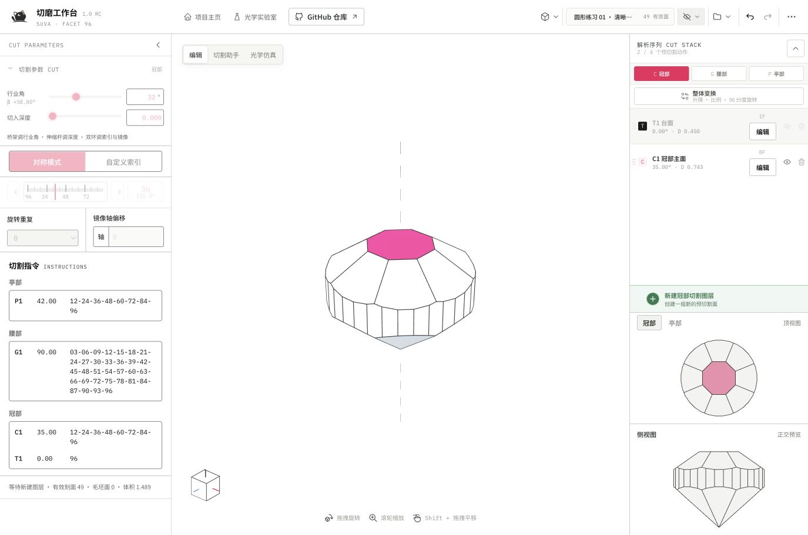
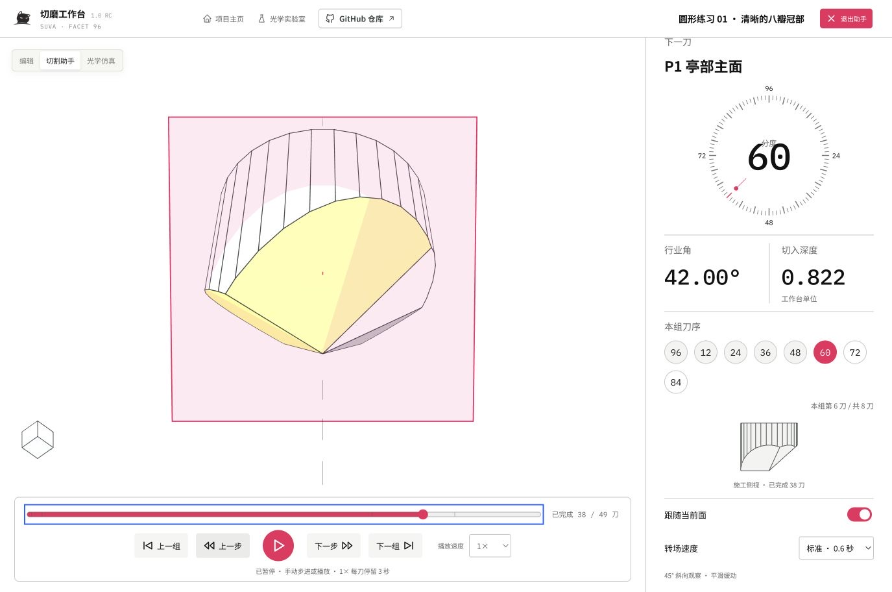
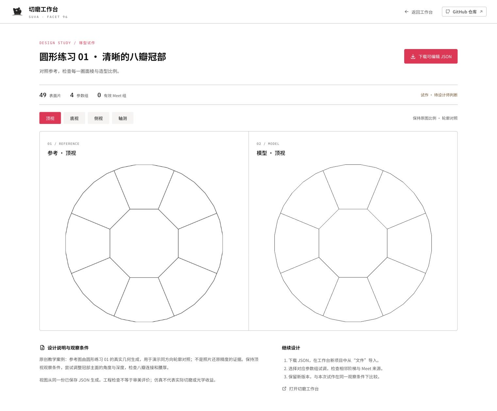

<div align="center">


# OpenGemCutting

**切磨工作台 · 让琢型设计，从一段对话开始。**

96 齿参数化切割 · 真实几何 · 逐刀演示 · Codex 辅助设计

[快速开始](#快速开始) · [用 Codex 设计](#用-codex-设计) · [操作手册](public/manual/facet-96-operation-manual.pdf) · [参与贡献](CONTRIBUTING.md)


</div>

> **1.0 RC 候选版** · 设计与几何计算在浏览器本地完成。独立部署无需 Codex、登录或 API Key；搭配 Codex 可从参考图构建可编辑的琢型，再用真实三视图反复校准。



## 从形状，到每一刀

| 设计 | 观察 | 交付 |
| --- | --- | --- |
| 连续角度、96 齿分度、旋转与镜像 | 顶视、底视、侧视及三维观察 | 完整参数化 JSON |
| Meet / Jump 与可回退的 CUT 序列 | 光学仿真与材质观察 | 可搜索中文的 PDF 切割报告 |
| 原创预设或导入闭合 OBJ 晶体 | 保留凹槽、孔及分离组件 | 带预检与能力提示的 GemCad ASC |

### 切割助手：边看，边理解工序

右侧仪表给出**下一刀**的分度、行业角、切入深度和本组刀序；底部播放器独立提供逐步、逐组、进度定位与自动播放。跟随当前面平滑转到 45° 斜向观察，可调整转场速度。手动操作与切到后台会暂停播放，退出后回到原编辑现场。



### 琢型试作：把参考与真实模型放在一起

同一份 JSON 驱动顶视、底视、侧视和轴测图。保留参考图片、比例说明与待确认项，下载后继续在工作台调整。截图中的教学参考由本项目原创几何生成，避免将漂亮的效果图当作工程实体。



## 快速开始

### 复制一句话给 Codex

```text
请按照 https://github.com/yuyou-dev/OpenGemCutting/blob/main/INSTALL.md 安装并启动完整 OpenGemCutting 切磨工作台，包含 OpenGemCutting Design 插件和 facet-parametric-design skill；在可用的 Codex 内置浏览器中打开工作台，验证后告诉我实际访问地址。
```

安装流程会启动本地服务、检查页面并安装设计插件。**当前候选版尚未推送时，远程 main 仍是旧版本**；本地验收应对这个候选目录执行 INSTALL.md。发布后上面的一句话即可获取完整发行版本。

插件是安装包，`facet-parametric-design` 是其中的设计流程。仓库同时携带与代码版本一致的完整 skill；即使没有插件管理能力，也可在此项目的新 Codex 任务中使用它。插件变更后按 Codex 界面提示重新加载插件或新建任务；不要把“已安装”误认为当前任务已加载。

已有安装可以让 Codex 按 [升级指南](https://github.com/yuyou-dev/OpenGemCutting/blob/main/UPGRADE.md) 更新；停止使用时按 [卸载指南](https://github.com/yuyou-dev/OpenGemCutting/blob/main/UNINSTALL.md) 保留设计并移除相应组件。

### 自己部署

需要 Node.js **20.19+（20.x）或 22.12+**，以及 npm。

```bash
git clone https://github.com/yuyou-dev/OpenGemCutting.git
cd OpenGemCutting
npm ci
npm run dev
```

打开终端打印的 `http://127.0.0.1:<临时端口>/`。端口由操作系统分配，不占用固定端口。生产构建运行 `npm run build`，静态前端在 `dist/client/`，Sites 服务入口在 `dist/server/index.js`；普通静态服务器部署前端即可。GitHub Pages 使用 `npm run build:pages`。子路径部署需配置 Vite base。

## 用 Codex 设计

1. 在 Codex 中打开安装好的 OpenGemCutting 项目，并启用 **OpenGemCutting Design** 插件，或直接使用仓库内 skill。
2. 附上有权使用的参考三视图、照片或草图，说明保持的比例和希望调整的部分。
3. 让 Codex 构建真实 CUT 分组、检查连接与对称、生成试作对照页。
4. 在工作台调整一组角度或深度，比较顶视和侧视；认可后导出 JSON 留存。

```text
使用 facet-parametric-design，根据这张图构建切角方形阶梯琢型。保持台面与腰厚比例；区分原图明确的信息和推断。交付可编辑 JSON、同尺度三视对照和待确认项，不把个人试作加入内置预设。
```

独立试作页的可复现入口：

```bash
npm run design:review -- docs/manual/examples/01-round-start.json --out output/my-study
```

命令打印应附加到工作台地址的 `?review=...` 参数。添加 `--reference image.png --views views.json --notes notes.txt` 可生成带裁切参考的对照；格式见 [设计 skill](.agents/skills/facet-parametric-design/SKILL.md)。试作输出保存在忽略的 `output/`，不自动上传。

## 五分钟完成一次设计练习

| 起点与意图 | 操作入口 | 判断结果 |
| --- | --- | --- |
| [圆形练习 01](docs/manual/examples/01-round-start.json)，观察清晰的八瓣冠部 | 新建项目 → 文件 → 导入 JSON | 顶视八瓣对称，侧视腰厚连续 |
| 改变冠部层次 | CUT STACK 选择冠部 → 编辑 → 调角度/深度 → 保存 | 固定观察方向，比较面宽和冠高；不满意可撤销 |
| 检查施工先后 | 画布左上 → 切割助手 → 下一组/播放 | “已完成”是已经切过的刀数，右栏始终提示下一刀 |
| 留存完整设计 | 文件 → 导出 JSON；需要施工表则导出 PDF | JSON 可再次导入并编辑，PDF 用于阅读与沟通 |

更多 Meet、双 Meet、凹晶体和可恢复操作见 [图解手册 PDF](public/manual/facet-96-operation-manual.pdf) 与 [教学案例](docs/manual/README.md)。

## 数据与支持范围

- 项目自动保存在当前浏览器。清除浏览器数据、切换浏览器或本地端口不会自动迁移项目；重要设计请导出 JSON。
- 新外部文件上限 20 MiB；JSON 最多 4096 个 CUT 平面，mesh stock 最多 20000 个顶点和 20000 个面片。OBJ 最多 4000 顶点、1000 源多边形且分解后不超过 1000 面片。超限会说明原因，当前设计保留。已有本机项目沿用原兼容规则。
- RC 验证环境与实际结果见 [支持与验收](docs/rc-validation.md)。Safari、Firefox 待验证；移动端暂不列为完整创作环境。
- 已有光学仿真可以使用；独立光学实验室仍为开发中入口。图形仿真与教学案例不保证实际切磨收益或某材料的光学等级。

## 开发与贡献

```bash
npm run check           # 公开扫描、领域回归、插件回归、构建与 Sites 验证
npm audit               # 当前依赖审计
npm run manual:build    # 从真实截图与教学案例重建 PDF
```

[开发规范](AGENTS.md) · [状态契约](state-contract.md) · [设计系统](design-system.md) · [ASC 规则](gemcad-asc.md) · [版本记录](CHANGELOG.md)

**OpenGemCutting Companion** 是可选的社区反馈与贡献插件，与设计插件分工独立。见 [插件说明](plugins/opengemcutting-companion/LIFECYCLE.md)。提交反馈时请附可复现步骤与脱敏 JSON；请勿提交原始个人资料或密钥。

[MIT License](LICENSE)。预设与第三方资源的来源、授权范围及品牌说明见 [THIRD_PARTY_NOTICES.md](THIRD_PARTY_NOTICES.md)。
