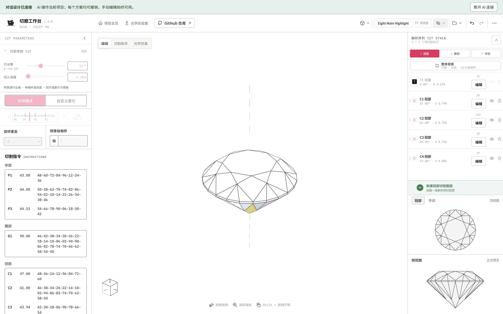
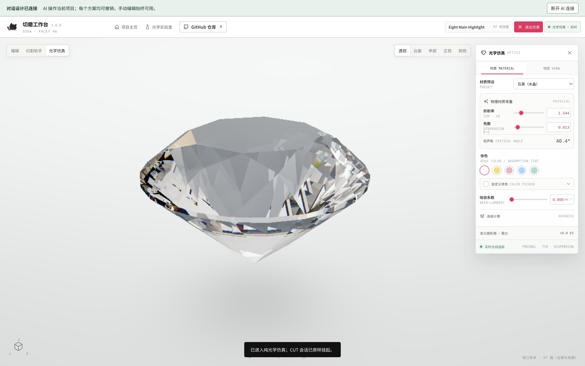
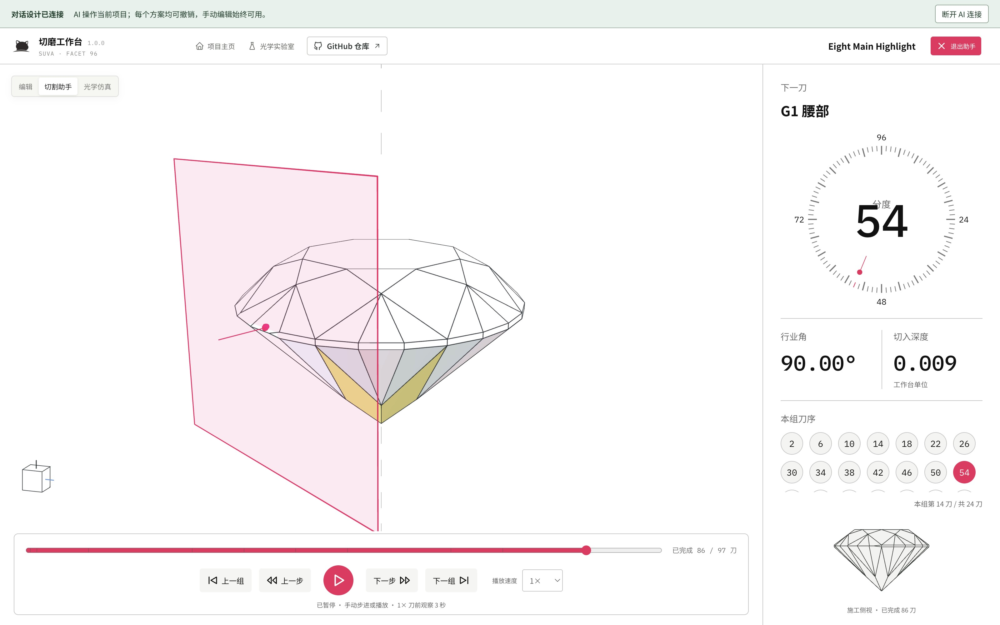

<div align="center">


# OpenGemCutting

### 从一句想法，到一颗可编辑的宝石。

**96 齿参数化琢型工作台 · 对话创作 · 浏览器本地运行**

An open-source gemstone faceting workbench. Design through conversation, refine every cut.

[](CHANGELOG.md)
[](LICENSE)
[](#start)

**[立即体验 ↗](https://yuyou-dev.github.io/OpenGemCutting/)**　·　**[用 Codex 创作](#install)**　·　[图解手册](public/manual/facet-96-operation-manual.pdf)　·　[参与贡献](CONTRIBUTING.md)

<br>



<sub>真实工作台 · 参数、工序和三维模型始终对应同一份设计</sub>

</div>

<br>

## 让每一次修改，都看得见

说出轮廓、比例和刻面节奏，让 Codex 构建真实模型；看过方案，再决定采用。也可以随时回到工作台亲手调整参数，沿着同一份设计继续创作。

| **用对话构思** | **用几何判断** | **把设计留下** |
| :--- | :--- | :--- |
| 从文字、草图或预设开始 | 三维与顶、底、侧视对照 | JSON 保留完整参数化工序 |
| 比较方案，继续提出修改 | 96 齿分度、重复、镜像与 Meet | PDF 切割报告便于沟通 |
| 预览后采用，也能撤销 | 光学仿真观察材质与亮暗 | ASC 预检后交换切割数据 |

<table>
<tr>
<td width="50%"></td>
<td width="50%"></td>
</tr>
<tr>
<td><b>看清造型与光线</b><br>在相同观察条件下比较材质、冠亭比例和亮暗。</td>
<td><b>理解每一道工序</b><br>逐刀或逐组回放；暂停、观察，再回到编辑。</td>
</tr>
</table>

<sub>展示琢型：PC 01.338 Eight Main Highlight，Long, R H &amp; Steele, N W；来源 Facet Design v5 (1984) pC12。可在预设库按名称载入。[来源与许可](THIRD_PARTY_NOTICES.md)。</sub>

<a id="start"></a>

## 选择你的开始方式

| | **浏览器单机版** | **Codex 对话版** |
| :--- | :--- | :--- |
| 适合 | 立即体验，亲手调整切型 | 描述目标，让 AI 构建与修改 |
| 准备 | 打开网页即可 | 已安装并登录 Codex |
| 能力 | 参数编辑、预设、仿真、保存与导出 | 全部手动能力，加上对话设计 |
| 入口 | **[打开 Live Demo →](https://yuyou-dev.github.io/OpenGemCutting/)** | **[复制安装提示词 ↓](#install)** |

单机版不需要 Codex、MCP、账号或 API Key。两种方式共用设计内核，AI 是可选的创作入口。

<a id="install"></a>

## 复制一句话，准备对话工作台

在可以正常对话的 Codex 中粘贴：

```text
请按照 https://github.com/yuyou-dev/OpenGemCutting/blob/main/INSTALL.md 安装完整 OpenGemCutting，配置运行环境、设计插件、MCP 和 skill，在 Codex 内置浏览器中打开工作台并确认连接。完成后告诉我如何直接开始琢型创作。
```

Codex 会检查依赖、配置设计组件，并核实对话对应的网页与项目。macOS 已实测；Windows 提供安装入口，实机支持进度见 [支持与验收](docs/validation.md)。首次加载工具时，客户端可能提示刷新或新开任务。

<details>
<summary><b>已经装好了？复制升级提示词</b></summary>

```text
请按照 https://github.com/yuyou-dev/OpenGemCutting/blob/main/UPGRADE.md 升级我的 OpenGemCutting 和对话设计组件，先保存并导出重要设计，保留本地修改，完成后重新连接内置浏览器，让我继续创作。
```

安装、升级和卸载各有一个维护入口：[INSTALL](INSTALL.md) · [UPGRADE](UPGRADE.md) · [UNINSTALL](https://github.com/yuyou-dev/OpenGemCutting/blob/main/UNINSTALL.md)。

</details>

<a id="create"></a>

## 你的第一颗宝石

在安装好的项目中，新开 Codex 任务并发送“打开工作台，开始对话设计”。随后像和设计伙伴讨论一样提出要求：

**01 · 建立起点**

> 帮我做一颗圆形、八向对称、台面清楚的基础琢型。可以从预设开始，先给我看真实模型。

**02 · 比较修改**

> 冠部再低一点，保留整体轮廓。给我看修改前后的差异，等我选择。

**03 · 留下方案**

> 采用这个方案。请保存，并给我一份以后能继续修改的设计文件。

也可以上传有权使用的草图，说明最在意的两三处特征。复杂参考需要多轮核对；模型预览、工序和导出文件才是判断结果的依据。

[五个对话体验任务](docs/mcp/designer-acceptance.md)　·　[手动练习与示例文件](docs/manual/README.md)　·　[完整操作手册 PDF](public/manual/facet-96-operation-manual.pdf)

<a id="source"></a>

## 给开发者和自部署团队

使用 Node.js 20.19+（20.x）或 22.12+：

```bash
git clone https://github.com/yuyou-dev/OpenGemCutting.git
cd OpenGemCutting
npm ci
npm run dev
```

打开终端打印的本机地址。`npm run build` 生成独立前端 `dist/client/`；GitHub Pages 使用 `npm run build:pages`。Linux 可按此源码路径运行。

需要对话能力时，执行 `node setup/cli.mjs install`。仓库包含完整设计 skill、MCP、安装模块和设计插件；Codex 应用、模型服务及账号另行准备。其他 MCP 客户端也可启动 `mcp/server.mjs`，浏览器接入方式见 [接口文档](docs/mcp/README.md)。

```text
src/domain + src/application  →  同一套几何与设计规则
              ↑                         ↑
        浏览器手动编辑             可选本地 MCP
```

```bash
npm run check          # 文档、领域、安装、插件与静态构建
npm ci --prefix mcp
npm run check:mcp      # 加上 MCP 的连接与版本检查
```

[架构与能力文档](docs/mcp/architecture.md)　·　[开发规范](AGENTS.md)　·　[文档索引](docs/README.md)

## 在开始前了解这些

- **请保留设计文件。** 项目保存在当前浏览器与地址下；更换浏览器、端口或清理浏览器数据不会自动迁移项目。重要设计请导出 JSON。
- **保留真实原石形状。** 支持闭合 OBJ，保留凹槽、孔和分离组件；导入上限与交换限制见 [文件与设计边界](docs/limits.md)。
- **仿真帮助比较。** 显示效果不代表实际切磨收益或材料光学等级。独立光学实验室仍为开发中入口。
- **支持按实测说明。** 本机功能已通过设计师验收；跨平台、浏览器与线上状态见 [支持与验收](docs/validation.md)，不以源码版本推断站点已更新。

## 一起完善这张工作台

欢迎提交可复现的问题、切型案例和聚焦改进。[Discussions](https://github.com/yuyou-dev/OpenGemCutting/discussions) 用于交流，[Issues](https://github.com/yuyou-dev/OpenGemCutting/issues) 用于缺陷，[贡献指南](CONTRIBUTING.md) 说明代码参与方式。

可选的 **OpenGemCutting Companion** 帮你整理社区反馈和贡献草稿，与设计插件分别安装；任何公开发送前都会展示内容并请求确认。[了解 Companion](plugins/opengemcutting-companion/LIFECYCLE.md)。

---

<div align="center">

**OpenGemCutting** · SUVA / Facet 96

[MIT License](LICENSE) · [第三方来源](THIRD_PARTY_NOTICES.md) · [品牌说明](TRADEMARKS.md) · [更新记录](CHANGELOG.md)

</div>
